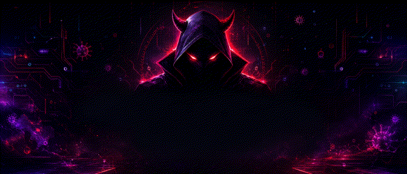
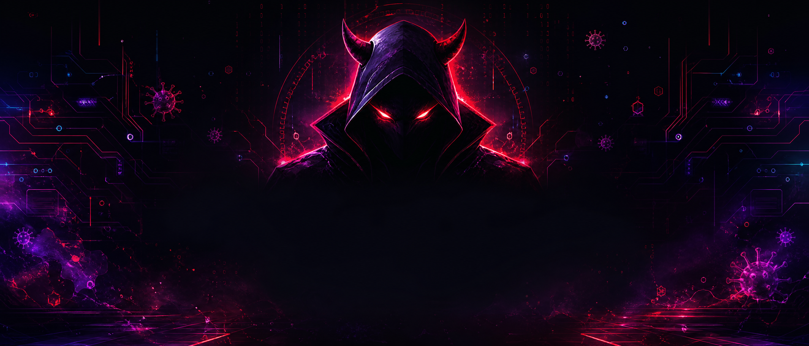

<div align="center">



# 𓆩 𝑺𝑨𝑰𝑵𝑻𝑩𝒀𝑷𝑨𝑺𝑺 𓆪🥷

### <span style="color:#ff1744">Code with precision.</span> <span style="color:#d500f9">Build with purpose.</span> <span style="color:#00e5ff">Move with stealth.</span>

`╔══════════════════════════════════════════════════════╗`

`║  ◈  CYBER DEVIL // HACKER MODE // SYSTEM ONLINE  ◈  ║`

`╚══════════════════════════════════════════════════════╝`

[](https://github.com/saintbypass-byte)
[](https://wa.me/263714373922)
[](https://t.me/saintxor)

</div>

---

## ◈ About the operator



I am **SAINTBYPASS**, a programmer focused on building sharp, practical, and modern digital experiences. My work sits at the intersection of software engineering, automation, web technologies, API development, and security-minded problem solving.

This repository is my public command center: a compact showcase of the technologies I work with, the systems I enjoy building, and the engineering mindset behind every project.

> **Mission:** Turn complex ideas into fast, reliable, and useful software.

## ☠ Core programming skills

| Area | What I build |
|---|---|
| **Frontend engineering** | Responsive interfaces, polished dashboards, interactive tools, and accessible user experiences. |
| **Backend development** | APIs, services, authentication flows, data processing, and scalable application logic. |
| **Automation** | Scripts and workflows that reduce repetitive work and connect systems intelligently. |
| **API integration** | Reliable connections between applications, services, bots, and external platforms. |
| **Security-minded development** | Careful handling of permissions, inputs, secrets, and system boundaries. |
| **Problem solving** | Practical debugging, rapid prototyping, refactoring, and performance-focused improvements. |

## ⚡ Technology toolkit

<div align="center">


</div>

## 🩸 Latest cool features

> **Visual theme:** The virus symbols in this README are purely decorative cyberpunk motifs representing bugs, signals, and digital energy. No malicious code or payloads are included.

### 🧠 AI-assisted workflows
Design intelligent tools that can summarize, classify, generate, search, and automate useful actions while keeping the user experience clear and controllable.

### 📡 Real-time experiences
Build live dashboards, status views, event-driven interfaces, and responsive systems that keep information moving without unnecessary friction.

### 🔌 API-first architecture
Create clean service boundaries that make products easier to extend, integrate, test, and maintain.

### 🛡️ Secure-by-design foundations
Treat authentication, authorization, input validation, secret management, and safe defaults as part of the build—not as an afterthought.

### 📱 Mobile-ready interfaces
Shape interfaces that feel natural across phones, tablets, and desktop screens, with layouts that remain focused at every size.

### ⚙️ Automation that saves time
Connect tools and remove repetitive steps through dependable scripts, scheduled workflows, and practical developer utilities.

## ⌁ Engineering style

```text
Observe  →  Design  →  Build  →  Test  →  Harden  →  Ship
```

I value readable code, deliberate interfaces, fast feedback loops, useful documentation, and solutions that solve the real problem instead of adding unnecessary complexity.

## ◉ Featured work

This space is reserved for selected projects, experiments, and tools. Each project should show not only what was built, but also the reasoning, trade-offs, and lessons behind it.

| Project type | Focus |
|---|---|
| **Web applications** | High-clarity interfaces backed by useful application logic. |
| **Developer tools** | Small utilities that make technical work faster and more reliable. |
| **Automation systems** | Repeatable workflows for data, services, and everyday operations. |
| **Experimental builds** | New ideas explored through working prototypes and focused iteration. |

## ☣ Connect

For programming, collaboration, project discussions, or technical conversations:

<div align="center">

`◈` `☠` `⚡` `⌁` `☣` `◉` `🧠` `🛡️` `🔌`

</div>

- **WhatsApp:** [+263 714 373 922](https://wa.me/263714373922)
- **Telegram:** [@saintxor](https://t.me/saintxor)
- **GitHub:** [@saintbypass-byte](https://github.com/saintbypass-byte)

<div align="center">

### Keep learning. Keep building. Stay original.

`[ ACCESS GRANTED ]`

</div>

---

<div align="center">

Made with focus by **SAINTBYPASS**.

</div>
